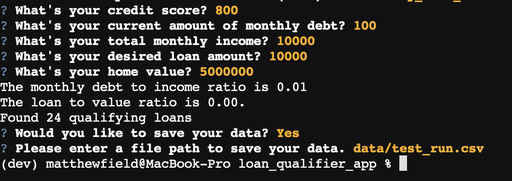
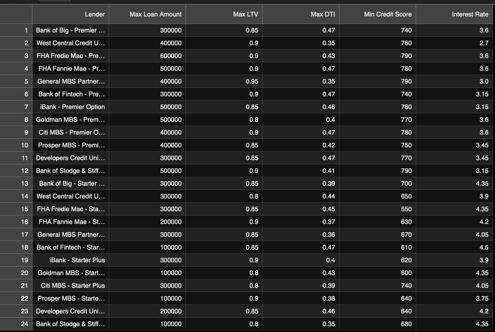

# Loan Qualifier Application

This is a command line application to match applicants with qualifying loans.
---

## Technologies

This app leverages Python 3.7 with the following packages: 

* [fire](https://github.com/google/python-fire) - For the command line interface, help page, and entry-point.

* [questionary](https://github.com/tmbo/questionary) - For interactive user prompts and dialogs

* [pathlib](https://github.com/jazzband/pathlib2) - For file manipulation. 

---

## Installation Guide

1. Clone the repo

2. Before running the application first install the following dependencies:

'''python
  pip install fire
  pip install questionary
  pip install pathlib
'''

---

## Usage

1. To use the Loan Qualifier simply open the loan_qualifier_app folder within the Starter_Code-2 folder of the repository and run the. ***app.py*** file. 

'''python app.py
'''

2. Upon launching the loan qualifier application you will be greeted with the following prompt asking for a file path to the data you wish to use: 

3. Once the application has loaded the data, it will prompt the user to enter their personal data. 

4. The application will then return the user's DTI and LTV ratios and with the number of potential lenders that they matched with along with a prompt to save the returned data to a new CSV file. 

5. If the user opts to save the new data, a CSV file containing their potential lenders will be generated to the file path they provide. 

---

## Contributors

The starter code was contributed by the [FinTech Bootcamp at Columbia Engineering](https://bootcamp.cvn.columbia.edu/fintech/)

Matthew Field finalized the application, his work is availble to view on [Github](https://github.com/mbf2139)

---

## License

MIT
